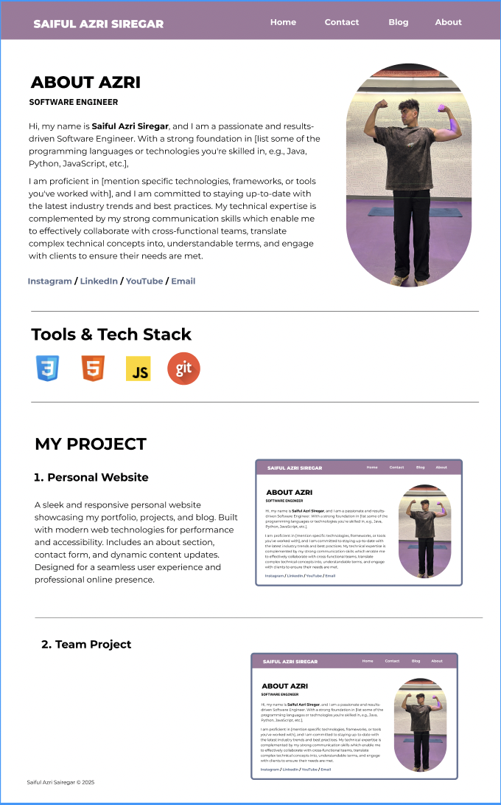

# Saiful Azri's Personal Website

Welcome to my personal website! I'm **Saiful Azri**, a web developer, technology enthusiast, and lifelong learner. Below are some details about me.

## About Me

I'm passionate about building web applications and exploring new technologies. In my free time, I love reading books, playing video games, and learning new programming languages.

## Skills

- Frontend Web Development (HTML, CSS, JavaScript)
- Backend Development (Node.js)
- Frontend Frameworks (React)
- Databases (PostgreSQL, MySQL)

## My Projects

Here are some of the projects I've worked on:

1. **Personal Website**: A portfolio website showcasing my skills and experience.
2. **Client Contacts**: A gym member/client contact management (address book).
3. **Workout Routine** / **Fitness Tracker**: A full-stack web app (task management).
4. **Healthy List**: A list of healthy foods (information API).

## Design

### Figma

[Figma link](https://www.figma.com/design/OJq6rDBbQEDs2uZy7rfwuh/saifulazri.com?node-id=0-1&t=4bOQwMnMfq2qkuPS-1)

### Screenshots

## Contact Me

- Email: [saifulazrisiregar@gmail.com](mailto:saifulazrisiregar@example.com)
- LinkedIn: [Saiful Azri Siregar](https://www.linkedin.com/in/saifulazrisiregar/)
